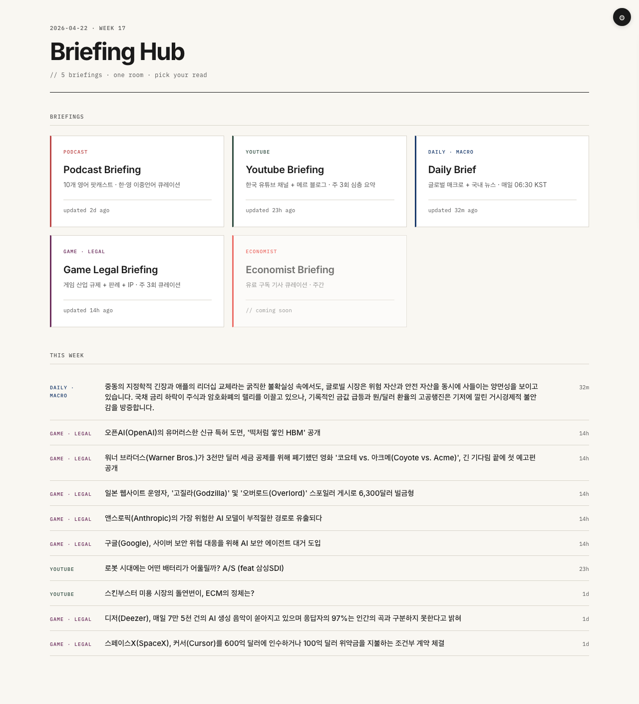
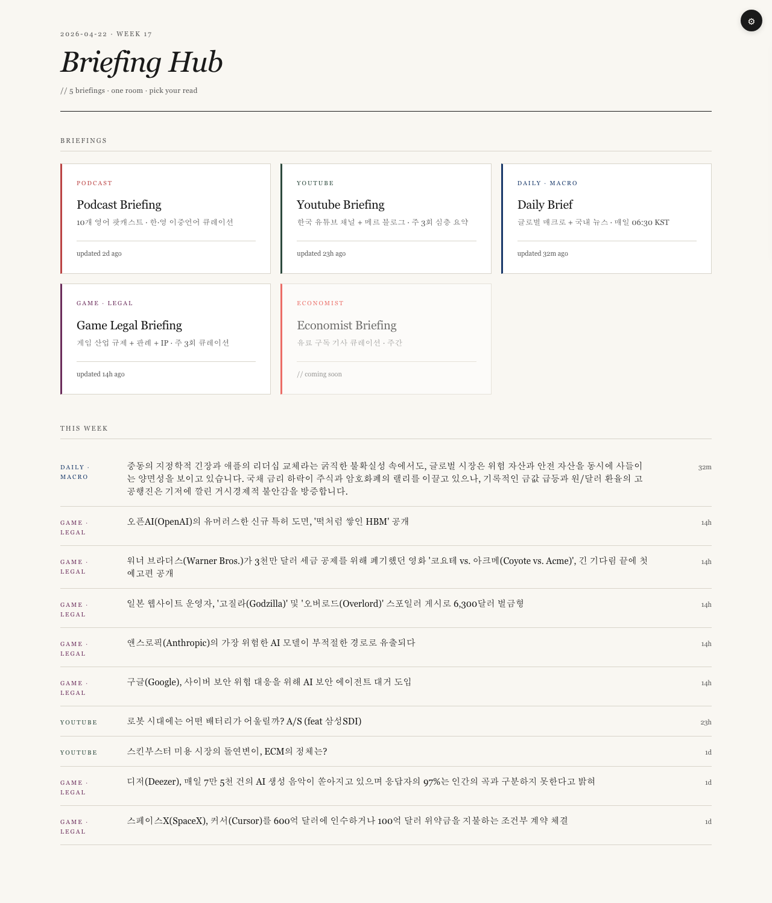
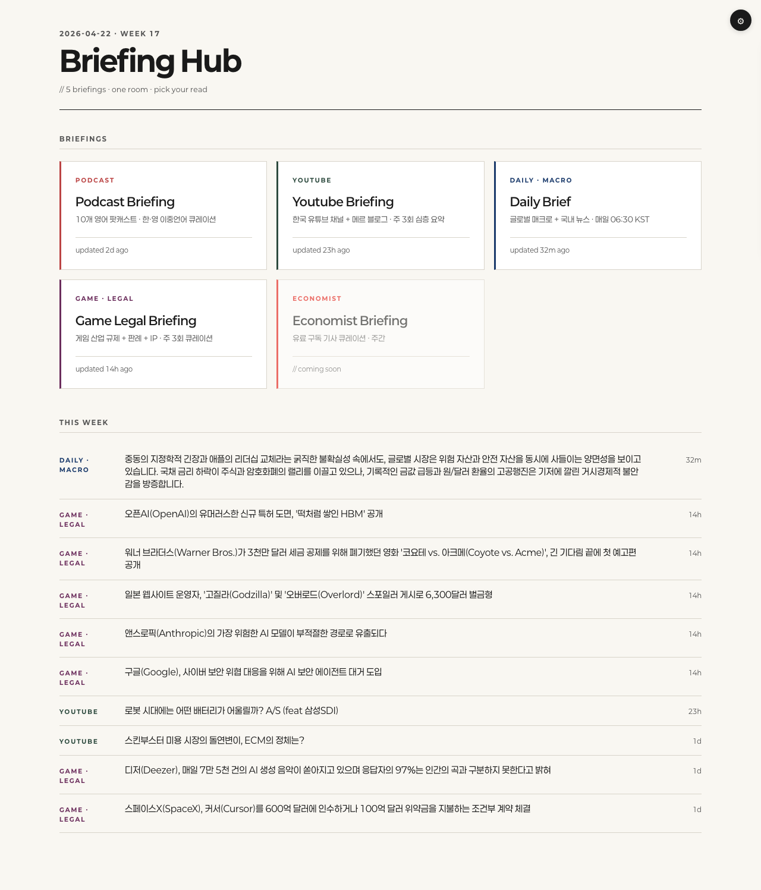
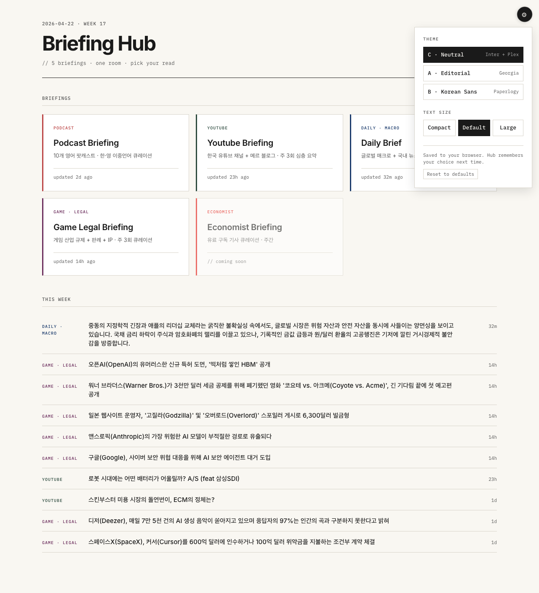

<div align="center">

# Briefing Hub

**브리핑 다섯 개, 한 공간. 골라서 읽으세요.**

KP의 브리핑 사이트들의 최신 항목을 모아 한 페이지에 보여주는
정적 Astro 포털입니다.

[**▸ 라이브 사이트**](https://kipeum86.github.io/briefing-hub/) &nbsp;·&nbsp;
[스펙](./DESIGN.md) &nbsp;·&nbsp;
[구현 플랜](./docs/superpowers/plans/2026-04-22-briefing-hub-phase1a-hub.md) &nbsp;·&nbsp;
[English](./README.md)

[](https://github.com/kipeum86/briefing-hub/actions/workflows/test.yml)
[](https://github.com/kipeum86/briefing-hub/actions/workflows/rebuild.yml)
[](./LICENSE)
[](https://astro.build/)

<br>



</div>

---

## 무엇을 하는가

KP는 다섯 개의 브리핑 사이트를 따로 운영하고 있습니다 — 영어 팟캐스트, 한국 유튜브,
데일리 매크로, 게임 업계 법규, 그리고 곧 합류할 Economist 큐레이션. 각 사이트는
자체 미학으로 별도 배포되어 있어, 다 챙겨 보려면 다섯 개 URL을 돌아야 했습니다.

Briefing Hub는 그 위의 현관입니다. 빌드 시점에 각 자식 사이트의 `/manifest.json`을
가져와서, 카드 그리드 + 주간 통합 하이라이트 피드 한 페이지에 최신 항목을 노출하고,
원본 출처로 바로 연결합니다. 허브 자체는 절대 브리핑이 되려 하지 않습니다 — 어디까지나
브리핑들 위의 인덱스입니다.

업데이트는 매일 `06:00 KST` cron으로 돌고, push할 때나 자식 사이트가
`repository_dispatch`로 신호를 보내면 즉시 재빌드됩니다.

## 아키텍처

```
┌────────────────────────────────────────────────────────────────────┐
│  kipeum86.github.io/briefing-hub/   (이 리포)                       │
│                                                                    │
│  • Astro 5 정적 사이트, GH Actions로 GH Pages 배포                  │
│  • 빌드 시점: 각 자식의 /manifest.json 병렬 fetch                   │
│  • slug별 <BriefingCard> + 통합 "이번 주" 피드                      │
│  • Theme A/B/C + 사이즈 — 런타임, localStorage에 저장               │
│  • Graceful degradation — manifest 실패 시 "점검 중" placeholder    │
└──────┬─────────────────────────────────────────────────────────────┘
       │ 빌드 시점 fetch (https 또는 dev에서 file://)
       ▼
┌──────────────┬───────────────┬──────────────┬─────────────────┬────────────────────┐
│  podcast-    │  youtube-     │  daily-      │  game-legal-    │  economist-        │
│  briefing    │  briefing     │  brief       │  briefing       │  briefing (예정)   │
│  (Astro)     │  (Astro)      │  (Python)    │  (Python)       │                    │
│              │               │              │                 │                    │
│  /manifest   │  /manifest    │  /manifest   │  /manifest      │  ...               │
│  + HubChip   │  + HubChip    │  + HubChip   │  + HubChip      │                    │
└──────────────┴───────────────┴──────────────┴─────────────────┴────────────────────┘
```

이 시스템을 묶는 두 가지 계약:

1. **매니페스트** — 모든 자식 사이트가 [DESIGN.md §4](./DESIGN.md#4-매니페스트-계약)에
   맞춰 `/manifest.json`을 노출합니다. 필수 필드는 강하게 검증, 선택 필드는
   누락돼도 우아하게 무시.
2. **HubChip** — 모든 자식 사이트가 우상단에 고정 위치 칩을 렌더링하여
   허브로 돌아갈 수 있게 합니다. 별자리 어디에서든 허브에 닿을 수 있도록.

[`src/config/briefings.ts`](./src/config/briefings.ts)가 허브가 아는
브리핑 목록의 **단일 진실 공급원**입니다.

## 테마

세 가지 런타임 테마. 우상단 톱니 아이콘으로 전환, 브라우저별로 저장됩니다.
같은 데이터·같은 레이아웃, 읽는 모드만 다릅니다.

<div align="center">

| **C · Neutral** &nbsp; *(기본)* | **A · Editorial** | **B · Korean Sans** |
|:--:|:--:|:--:|
| Inter + IBM Plex Mono | Georgia 이탤릭 디스플레이 | Paperlogy 800/600 |
|  |  |  |

</div>

옵션 패널에서는 텍스트 크기도 조절 가능합니다 (compact / default / large).
두 선택 모두 localStorage 키 `briefing-hub:prefs`에 저장됩니다.
`<head>`의 FOUC 방지 인라인 스크립트가 paint 전에 동기적으로 저장된
테마를 적용하므로, 새로고침 시 기본 테마로 깜빡이지 않습니다.

<div align="center">

</div>

## 빠른 시작

```sh
git clone https://github.com/kipeum86/briefing-hub.git
cd briefing-hub
npm install
npx playwright install chromium    # 처음 1회만

npm run dev                         # http://localhost:4321
```

| 명령                  | 동작                                                      |
|-----------------------|-----------------------------------------------------------|
| `npm run dev`         | Astro 개발 서버 (HMR)                                     |
| `npm run build`       | `astro check` + 프로덕션 빌드 → `dist/`                   |
| `npm run preview`     | 빌드 결과를 로컬에서 확인                                 |
| `npm test`            | Vitest 단위 테스트 (manifest, time, highlights, prefs)    |
| `npm run test:e2e`    | Playwright 스모크 (패널, 테마 영속, 사이즈 스케일)        |

## 새 브리핑 추가하기

1. [`src/config/briefings.ts`](./src/config/briefings.ts)의 `BRIEFINGS`에
   항목 추가 — `slug`, `name`, `category`, `accent`, `description`,
   `manifestUrl`, `siteUrl`. accent는 기존 색상과 겹치지 않게.
2. **사전 빌드**: [매니페스트 스키마](./DESIGN.md#4-매니페스트-계약)에 맞는
   `mocks/<slug>.json`을 만들고 `manifestUrl: "file:./mocks/<slug>.json"`
   사용. 자식 사이트에 의존하지 않고 빌드·미리보기 가능.
3. **자식 사이트 준비 완료**: `manifestUrl`을
   `https://kipeum86.github.io/<slug>/manifest.json`로 바꾸고 mock 삭제.
4. 자식 쪽에는 `/manifest.json` 엔드포인트 + `HubChip` 컴포넌트를 넣어주세요.
   동작하는 예시:
   [youtube-briefing](https://github.com/kipeum86/youtube-briefing/blob/main/src/pages/manifest.json.ts)
   (Astro/TS),
   [daily-brief](https://github.com/kipeum86/daily-brief/blob/main/pipeline/render/manifest.py)
   (Python/Jinja).

## 배포

`rebuild-and-deploy` 워크플로 트리거:

- `main` push (경로: `src/**`, `public/**`, `mocks/**`, configs)
- 매일 **06:00 KST** cron (`0 21 * * *` UTC) — 안전망
- `briefing-updated` `repository_dispatch` 이벤트 — 자식 사이트가
  publish 완료 시 발송
- 수동: Actions → `rebuild-and-deploy` → Run workflow

신규 방문자의 기본 테마는 GitHub repo Variables의 `PUBLIC_HUB_DEFAULT_THEME`
(`a` / `b` / `c`)으로 설정 가능. 기존 방문자는 저장된 선택을 유지하므로
첫 방문자만 새 기본값을 받습니다.

## 프로젝트 구조

```text
.github/workflows/   test + deploy 워크플로
docs/
  screenshots/       README 자료
  superpowers/       구현 플랜
mocks/               아직 manifest 미발행 자식의 로컬 매니페스트
mockups/             빌드 전 HTML 목업 (인터랙티브 비교 페이지)
public/              favicon, fonts.css
src/
  components/        Masthead, BriefingCard, HighlightsList, OptionsPanel...
  config/            BRIEFINGS — 단일 진실 공급원
  lib/               manifest, time, highlights, hub, prefs (TDD)
  layouts/           BaseLayout (FOUC 스크립트 + meta + slot)
  pages/             index.astro — 단일 페이지
  styles/            tokens.css (Theme C 기본), themes.css (A/B), base.css
tests/e2e/           Playwright 스모크
DESIGN.md            전체 스펙
```

## 별자리

| 리포 | 역할 | 스택 |
|------|------|------|
| **briefing-hub** *(이 리포)* | 포털 애그리게이터 | Astro 5 + TS |
| [podcast-briefing](https://github.com/kipeum86/podcast-briefing) | 10개 영어 팟캐스트, 주간 | Python + Astro |
| [youtube-briefing](https://github.com/kipeum86/youtube-briefing) | 한국 유튜브 5채널 + 메르 블로그 | Python + Astro |
| [daily-brief](https://github.com/kipeum86/daily-brief) | 글로벌 매크로 + 한국 뉴스, 매일 06:30 KST | Python + Jinja |
| [game-legal-briefing](https://github.com/kipeum86/game-legal-briefing) | 게임 업계 규제, 월·수·금 | Python + Jinja |
| economist-briefing | Economist 큐레이션 | *준비 중* |

## 라이선스

[Apache 2.0](./LICENSE) — [Kipeum Lee](https://github.com/kipeum86) 만듦.
